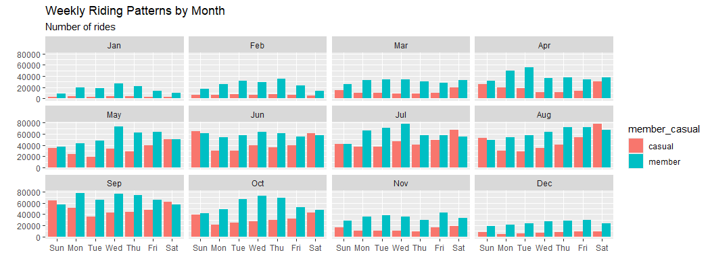
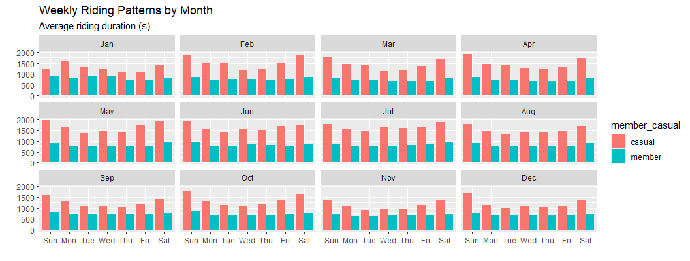
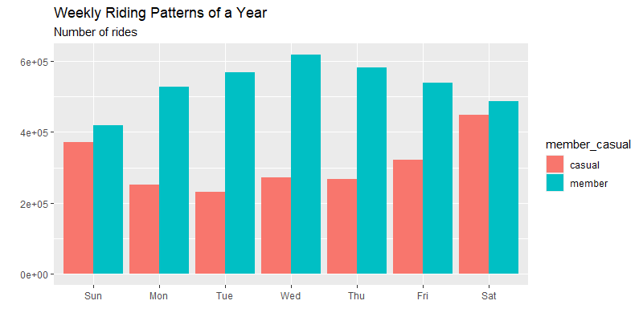
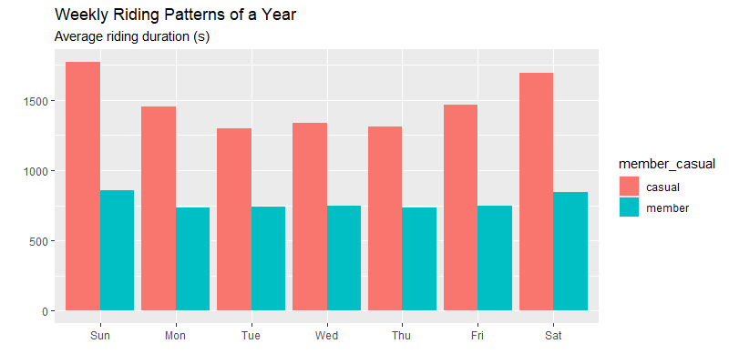

# Case_Study_Google_Data_Analytic_Course
This is case study 1 in the Google Data Analytics Capstone: Complete a Case Study.
Click [here](Coursera%20H5UFB3DW3SYG.pdf) to view the certificate.

## Scenario
I am a junior data analyst at a fictional bike-share company in Chicago. The director believes that future success depends on maximizing the number of annual memberships. Therefore, the task is to understand how casual riders and annual members use bikes differently.
## Data
[The previous 12 months of trip data](https://divvy-tripdata.s3.amazonaws.com/index.html) is under the [license](https://divvybikes.com/data-license-agreement). This is public data that we can use to explore how different customer types are using our bikes. But note that data-privacy issues
prohibit us from using riders’ personally identifiable information. This means that we won’t be able to connect pass purchases to credit card numbers to determine if casual riders live in the service area or if they have purchased multiple single passes.
## Work in R
Please download the data from 2023/12 to 2024/12 [here](https://divvy-tripdata.s3.amazonaws.com/index.html). After loading data to your RStudio, you can follow the instructions in R, as follows:
* Join these datasets by rows and transform the date time for analysis. 
* Calculate the riding duration to clear all the bad data that contains negative values. 
* Verify the rider type that should only contain "member" and "casual". 
* Calculate the number of trips and the average riding duration during a week, both monthly and throughout the previous year.
* Visualize both in R and export results for Tableau.
For more details, please check the [Case_Study_1](R_for_case_study/case_study_1.Rmd) file.
## Preliminary results in R
Following the instructions in [Case_Study_1](R_for_case_study/case_study_1.Rmd), four graphs can be generated.
### The first two are the weekly rides and riding durations by month:  
 
  
### The last two are the rides and riding durations throughout the previous year:  
 
   
These graphs indicate some trends:
* Casual riders have more riding durations than annual members.
* Casual riders have fewer rides than annual members.
* The most popular riding time of the week is weekends.
* The most popular riding time of the year is April to October.
With these observations, we can design marketing strategies to convert casual riders into annual members.
## Visualization in Tableau
After the data analysis in R, the results are put into Tableau for visualization. Currently, there are two versions: [Analysis result throughout the previous year](https://public.tableau.com/app/profile/tien.chi.lin/viz/Case_study1_17342928667420/Weekly_Num_Ride_by_Year) and [monthly analysis result](https://public.tableau.com/app/profile/tien.chi.lin/viz/Case_study1_17342948870680/Dashboard).
## License
The trip data is under the [license](https://divvybikes.com/data-license-agreement).
